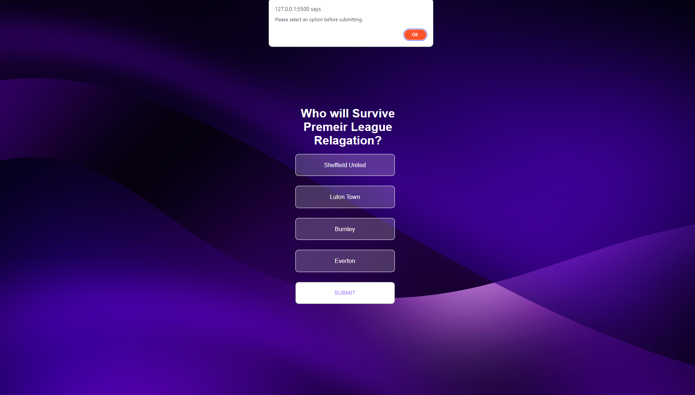
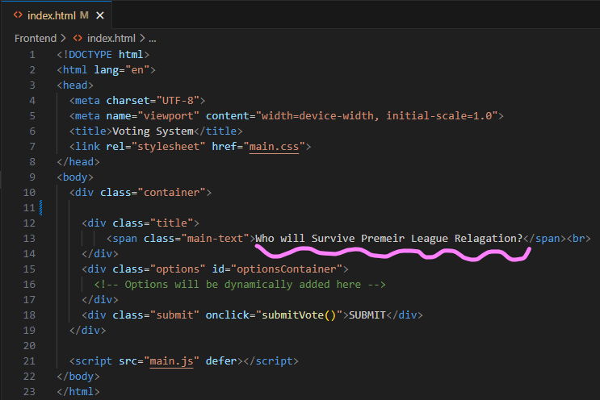

# Voting Web App

## Table of Contents

- [File Stucture](#file-stucture)

- [Running web app locally](#running-web-app-locally)
- [How It Works](#how-it-works)
- [Things I could not Finish](#things-i-could-not-finish)
- [Assumptions](#assumptions)
- [Improvements](#improvements)
- [Testing](#testing)
- [Security Problems](#security-problems)
- [Technologies](#technologies)

## File Stucture
There are two depostories which separate the frontend and backend functionalities. 

### Backend
- data.json: The following JSON file contains the poll options and keeps a record of the amount of votes each option receives.

- index.js: The node.js file is responsible for hosting the API logic

- package-lock.json / package.json: These json files specify the desired depencies, allowing me to utilise express for API use

- node_modules: This folder stores all the dependencies required for the Node.js project

### Frontend
- main.js: This file contains the functionality of the voting page ( fetches poll data from the server, allows users to select an option, submits their vote to the server, and redirects them to the results page)

- results.js: This files contains the functionility of the results page (fetches poll data from the server, renders poll results data on page)

- main.css: This CSS file defines all visual apperances and layouts between both pages

- index.html: defines the structure and layout of the voting page, including elements for displaying content, interactive components, and CSS linkage

- results.html: defines the structure and layout of the results page, including elements for displaying content, interactive components, and CSS linkage
## Running web app locally

To launch the server, first within the terminal, enter the *Backend* folder and run the command:
~~~bash
$ npm start
~~~

You will know it has started if no errors occur and the terminal reads:

~~~bash
Server is running...
~~~

Now using VScode press *F1* to reveal the drop down menu or simply use the search bar at the top to type in or select:
~~~
> Live Server: Open with Live Server
~~~

This will load the running web app within a web browser, once here select *Frontend* and the page in front of you should look like:

## How It Works
- Currently the main page has four options although, this can be configured by the use of adding or taking away from the *data.json* file 

- When you click on an option, the boarder of that option will increase, signifying this is the option you have chosen

- Clicking on another option will result in the previously selected option to be deselected as only one option can be selected at any given time

- Clicking submit will firstly, update the poll votes (*data.json* file) and add one vote to the selected option, it will also redirect you to the result page

- An option has to be selected for you to proceed, if click submit and do not select an item the browser will notify you to select one before submitting

- The results page will fetch the data with the updated results and present them like so:

- The results page will also order all options from highest percentage of votes at the top to lowest at the bottom

## Things I could not Finish
- Styling the title properly with only the bottom half being bold

- Placing the title in the JSON file so that I can use the API to obtain this information, as of now it is being hard coded into the html file

- Including specific Font styles within the options, submit button and the title

## Assumptions
- There is an assumption that if this was deployed into production, it would also work on mobile devices

## Improvements

- When a option is selceted, it can be unselected by clicking the same option again

- Have the bars and number percentage load up instead of automatically be there 

- Have an admin interface to dynamically change polls and and create different ones

- Having using authentication, this can help with tracking user votes

- Implement testing strategies, imcluding unit testing and end to end testing

## Testing 

The main form of testing for the front end was visual regression testing.

- Images were screenshot before and after code changes to visually understand the changes made to the web application

The main method of testing for the backend was unit testing.

- I individually tested all function to make sure they gave me the desired output I needed.

## Security Problems

### Insecure API endpoints
Having insecure API endpoints could lead to unathorised access or manipulation to data

### Cross-Site Scripting (XSS)
If a users input is not properly sanitized or validated, attackers could inject malicious scripts into the application, which could be executed within the context of other users' browsers

## Technologies
Upon research on what language to use to host my server I chose node.js (express) this is because:

- Using one lanuage for client and server side drastically simplifys this, it is good to keep it simple for simpler tasks
- It allowed me to reuse code and reduce cross language integration
- Node.js is known for it high performance and is best suited for building real-time applications 

